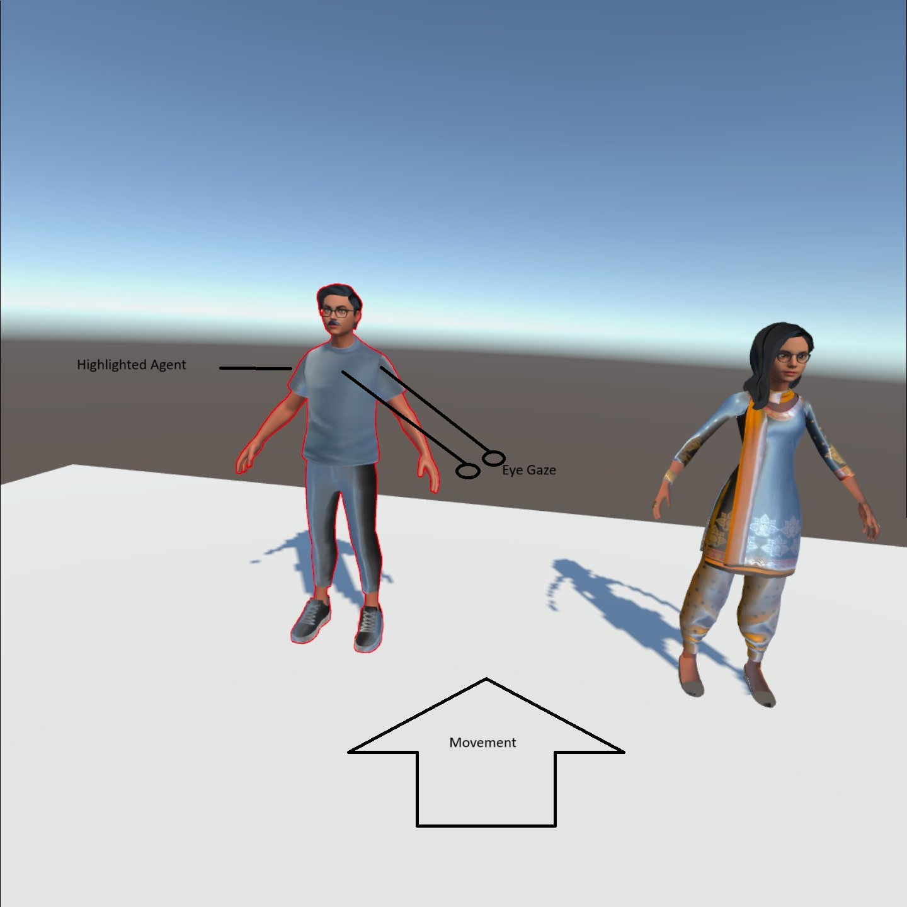

# [Effect of sympathetic relation and unsympathetic relation in multi-agent spoken dialogue system](https://ieeexplore.ieee.org/document/7803128)

This paper is about a multi-agent conversation and studying the effects of using sympathetic speech when engaging with users. Sympathetic speech is defined as speech from the agent that revolves around the user, for example, if the user were to talk about udon as the paper states, the agents would also focus on the topic of udon. The agents would discuss it with the user and with each other. The criteria for comparing sympathetic and unsympathetic speech systems were: natural conversation, interesting conversation, various opinions, familiarity with the agent, lively conversation, and like chatting, all on a 5-point Likert scale. The results indicated that sympathetic speech systems could provide significantly better lively conversations. A more interesting result was that unsympathetic speech systems performed better in providing various opinions, which may be due to sympathetic speech focusing on the user.
The paper also compares multi-agent sympathetic speech systems with sing-agent sympathetic speech systems with the same criteria as before. The results here indicate that multi-agent sympathetic speech systems significantly perform better in providing lively conversation and in making the conversation feel like an actual chat.
Given the existing literature on multi-agent systems and on the effects of empathetic speech, the paper set out to find out how both concepts together could provide a livelier conversation. The main limitation of the system was in how their response generator could only work for a few general topics rather than any general topic the user chooses. This can be solved as I did in my implementation by using a GPT model and prompt engineering it to be able to respond to any topic.

# [Inferring User Intent using Bayesian Theory of Mind in Shared Avatar-Agent Virtual Environments](https://ieeexplore.ieee.org/document/8642370)

The paper presents ATOM, a real-time algorithm that aims to facilitate more natural interactions between a user’s avatar and multiple human-like virtual agents in complex virtual environments. ATOM does this by inferring the user’s underlying intent, which is either to avoid or engage with an agent, based on the user's gaze and proxemics. This inferred intent is then used to guide the virtual agent’s response. The authors argue that this is important because more realistic avatar-agent interactions in virtual reality (VR) applications can be used for training, therapy, games, and architectural walkthroughs.
The algorithm was evaluated on various benchmarks (Standing Agents, Crossing Flow, Antipodal Circle Crossing, Shibuya Crossing) and was shown to significantly reduce the rate of false inferences compared to a prior method: PedVR. It also reduced the average inference time. A user study showed that participants felt significantly more comfortable sharing the virtual environment with ATOM agents. They also found ATOM agents to be less intrusive and more plausible in their responses compared to the baseline method.
ATOM introduces a novel approach to modeling user intent in multi-agent virtual environments, going beyond simple rule-based systems, leading to a more comfortable and natural interaction. However, the algorithm only considers two user intentions: avoid or engage. Future research should try to include more user intentions to flesh out the system. Another limitation is that the current implementation only allows for intent inference and gaze-response towards a single user, neglecting potential interactions between agents. Within my implementation, I considered both movement and eye gaze in identifying the intended user. The intended agent is highlighted as a result.

https://github.com/user-attachments/assets/578f9df7-feb8-4fa4-831a-9869c76f93be

# [The Impact of Virtual Reality in the Social Presence of a Virtual Agent](https://dl.acm.org/doi/10.1145/3383652.3423879)
This research paper investigates how the feeling of "being there" with a virtual character, called social presence, changes depending on whether the interaction happens in virtual reality (VR) or on a traditional computer screen. The authors designed a police interview simulation where participants interact with a virtual suspect, aiming to understand if VR enhances the perception of the character's social presence. Their results show that participants who experienced the interaction in VR did report a higher sense of social presence, particularly in areas like co-presence and perceived emotional understanding. While the virtual character was found believable in both settings, the study suggests that VR can create a more impactful social interaction with virtual agents.
The police interview scenario, while realistic, might not be the most effective for studying all aspects of social presence, particularly emotional and behavioral interdependence. The adversarial nature of the scenario could lead participants to suppress their emotional responses and limit the impact of the virtual agent's behavior on them. Exploring alternative scenarios where the virtual agent is not perceived as an opponent could provide a more comprehensive understanding of social presence. Within my implementation, the avatar is more sociable and the system is designed for friendlier conversations.

